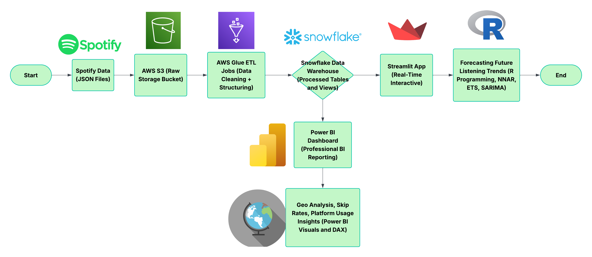
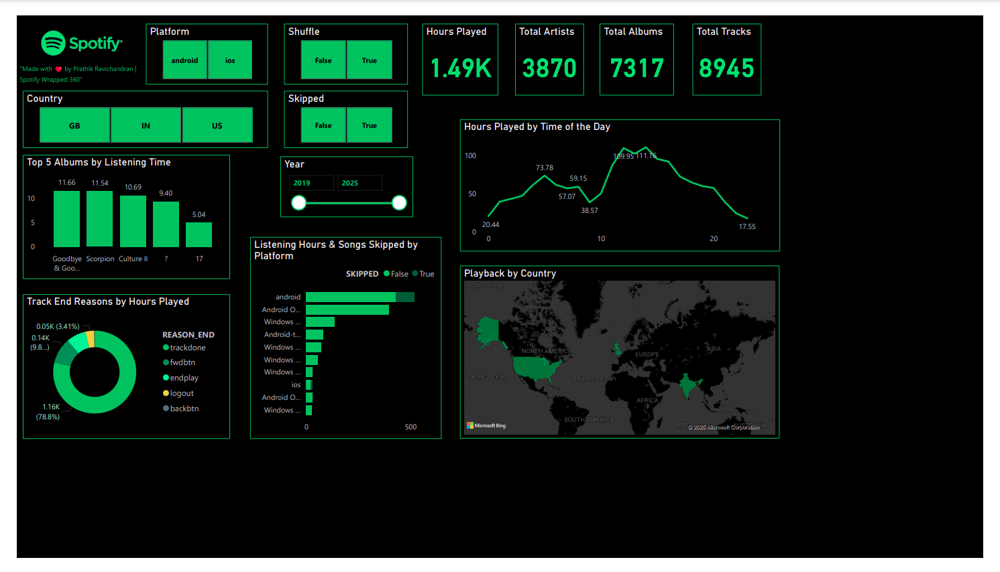
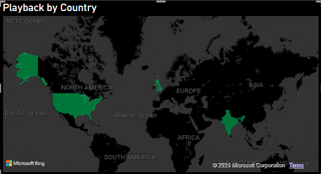
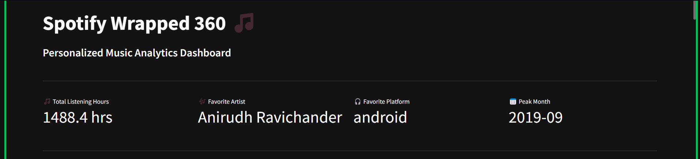
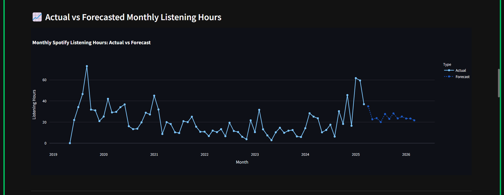

# Spotify Wrapped 360 🎵

**Personalized Music Analytics Dashboard | Powered by AWS, Snowflake, Streamlit, R, and Power BI**

---

## 🚀 Project Overview
This project replicates a "Spotify Wrapped" style analytics experience using personal listening data.  
Built end-to-end from raw JSON exports to fully interactive cloud dashboards and machine learning-based forecasting!

---

## 🔥 Tech Stack

- **AWS S3** — Data storage
- **AWS Glue** — ETL pipeline
- **Snowflake** — Data warehouse
- **Python + Streamlit** — Interactive web app
- **R Programming** — Time series forecasting
- **Power BI** — Business intelligence dashboard
- **Spotify API** *(optional for future work)*

---

## 📈 Key Features

- 📅 Monthly listening trends
- 🎧 Top artists, albums, platforms
- 🌍 Listening map by country
- 📊 Forecasting future listening hours (NNAR, ETS, SARIMA)
- 📱 Device/platform breakdowns
- 🕵️‍♂️ Incognito listening behavior
- 🎶 Track skipping behavior
- 🎯 Shuffle vs offline listening analysis
- 🎨 Full Spotify-themed UI

---

## 🛠 Project Architecture
Spotify Data → AWS S3 → AWS Glue ETL → Snowflake Warehouse → Streamlit App & Power BI Dashboards
### 🎨 Workflow Architecture

---

---

## 📸 Screenshots

### 🎨 Full Power BI Dashboard

### 🎶 Top 5 Albums Analysis

### 🌍 Listening By Country

### 📈 Streamlit Hero Page

### 🔮 Forecasted Listening Hours

---

## ⚙️ How to Run

1. Clone this repo
2. Open `app.py` → run with Streamlit
3. Run the app.py file manually or use Google Colab file ``to run it by uploading it.
4. Open `.pbix` file with Power BI Desktop
5. Explore dashboards & forecasting!

---

## ❤️ Author

Made with ❤️ by **Prathik Ravichandran**  
*(Connect with me on LinkedIn, GitHub coming soon!)*

---
